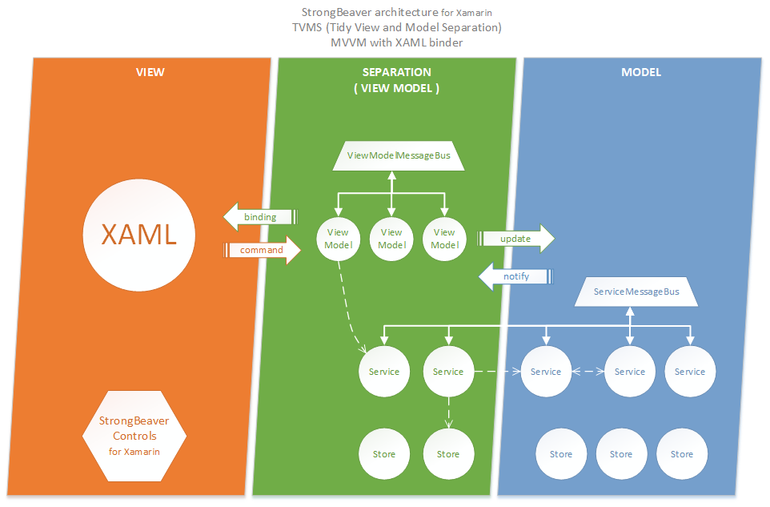
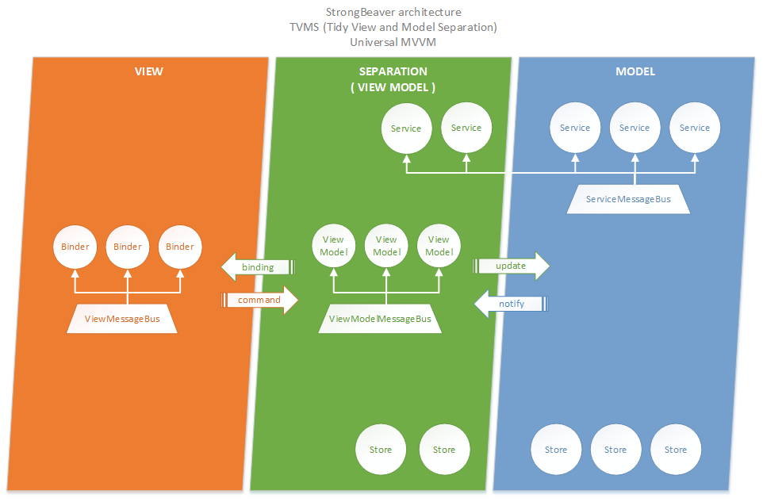
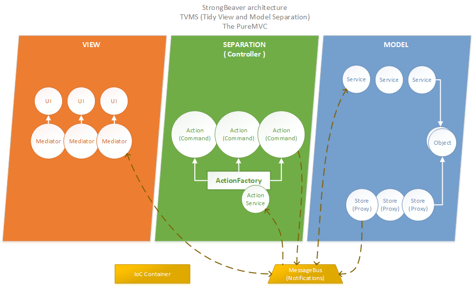

# StrongBeaver Framework

The StrongBeaver is .NET application framework mainly designed for Xamarin, but can be used with any platform and any layered architecture.


**The Framework is in early stage (ALFA version). A lot of stuff can be changed and unit testing is coming. Can be used for testing and as a playground, but for a real deployment please wait for a stable release.**

> Simplicity is the ultimate sofistication.
>
> &mdash; *Leonardo da Vinci*

## Introduction

The architecture is called **TVMS** from ***T**idy **V**iew and **M**odel **S**eparation* and has been designed to be able to use it with any View-Model layered application.
The middle layer is universally named **separation**, which can be used with any well-known patterns, e.g. [MVC](https://en.wikipedia.org/wiki/Model%E2%80%93view%E2%80%93controller), [MVVM](https://en.wikipedia.org/wiki/Model%E2%80%93view%E2%80%93viewmodel), or any [MVP](https://en.wikipedia.org/wiki/Model%E2%80%93view%E2%80%93presenter).

> The pattern **TVMS** has been created to help us to simplify application design and guide us how to separate concerns of layers and minimise coupling inside sub-systems.

The Framework as one product is called **StrongBeaver**. The concepts and base interfaces can be used for any .NET application, but the framework is mainly created for *[Xamarin](https://www.xamarin.com/) platform*.

## Architecture pattern diagrams

The framework is mainly designed for *Xamarin* platform, but can be used with any layered architecture. See diagrams below.

### MVVM with universal XAML binder



### Generic MVVM



### MVC (model-view-controller)


### The PureMVC



## Concepts

Concept | Description
--- | ---
Activator | Static public class which will be called on application start for initialisation purposes.
Binder | Middle-man responsible for data and commands binding between view and view model.
IoC and DI | Inversion of Control and Dependency Injection are the heart of this framework.
Manager | Long-life and stateful service inside a specific instance of object.
MessageBus (Messanger) | Message bus for a specific group of objects, e.g. services or view models.
Provider | The facade / locator for a specific type of objects, e.g. services, view models and more.
Service | Stateful or stateless, singleton and long-life service, which is registered in system.
ServiceLocator (IoC) | [ServiceLocator](https://msdn.microsoft.com/en-us/library/ff648968.aspx) is an abstraction of IoC container, which is used in the framework.
Store | In memory storage, responsible for caching and reusability of objects.
Strategy | Lightweight service / behaviour inside a instance of object, which is used in unit of work approach.
TVMS (Tidy View and Model Separation) | Universal architectural pattern for any layered application.
View Model | Bindable model of view, brinks for MVVM and binding is a grout.
XAML | In the Microsoft solution stack, the universal binder is a markup language called XAML.

## Framework basics

> Everything is implemented with the main focus on **extensibility** and **flexibility**.

The heart of the framework is **IoC container** wrapped by [ServiceLocator](https://msdn.microsoft.com/en-us/library/ff648968.aspx) pattern and **ISimpleIoc** interface from [MVVM Light Toolkit](http://www.mvvmlight.net/), which allow us to use any IoC container.

The main concept is **services**, which should be registered in global IoC container and for less coupling, they can communicate through a shared **message bus**. The concept of services with message bus is accessible via facade **ServiceProvider**. Respectively each layer is realised by own provider and main object type, e.g. the view model layer contains many **ViewModels** and **ViewModelProvider**.

With a problem of *data caching* or *in-memory storage* helps the concept of **stores**. A store can handle *life-time* and *destruction of stored objects*.

For better code management and low coupling, we are recommending to use [Strategy pattern](https://en.wikipedia.org/wiki/Strategy_pattern) as much as possible. We are even splitting this pattern into more detailed cases. The first one we called same like pattern itself, therefore **Strategy** and should be used as a unit of the work, the instance of the strategy class will be created before calling an executive method and after execution would be forgotten. The Second case is when you need behaviour with state and longer lifetime, but only per one instance of an object, in this case we call it **Manager**. The *singleton* strategy (stateful or stateless) which can be used in many places in the system is realised by already spoken **Service** concept.

> We are working on concepts of generic **Behaviours** and **States** of any object but mainly used for UI components. *We're going to describe it soon.*

## Recommendations and guidelines

With the architecture pattern and framework, we are coming with recommendations, as well. These guidelines can be followed or not. They can help with better and cleaner application design and code base.

> We will add more recommendations and specify *code standards* with *naming convention* during the Framework growth.

* Each class should have one and only one responsibility.
* Every public type which can be used and extended outside a namespace should be  available also as an interface instead of just as a class.
* Strategy pattern should be used as a unit of work (one instance per call), in other cases, we are speaking about a Manager or a Service.
* If a behaviour / responsibility needs to have a state and would have long-life, then should be designed as a Manager.
* If a Provider contains a message bus, then the bus should be used only by objects which provider provides.

> Our codding bible is [Clean Code](https://www.amazon.com/Clean-Code-Handbook-Software-Craftsmanship/dp/0132350882) and we follow [SOLID](https://en.wikipedia.org/wiki/SOLID_(object-oriented_design)) principle.

## Dependencies

Dependency | Description
--- | ---
[CommonServiceLocator](https://github.com/unitycontainer/commonservicelocator) | The library provides an abstraction over IoC containers and service locators. Using the library allows an application to indirectly access the capabilities without relying on hard references.
[MVVM Light Toolkit](http://www.mvvmlight.net/) | The framework takes a lot of inspiration from this great and powerful toolkit. *This dependency will be integrated.*
[Json.NET](https://www.newtonsoft.com/json) | The JSON is the most popular data transfer format used on the network and for communication between systems.
[Popup Page Plugin for Xamarin](https://github.com/rotorgames/Rg.Plugins.Popup) | Xamarin plugin which is used for showing user-defined dialogues. *This dependency would be removed soon.*

## Service list

>* A service written in **Bold** is already done.
>* A service written in *Italic* will be implemented.

* *Accounts* - Service for authenticating users. Support for *OAuth protocols* and third-party services, e.g. *Facebook*, *Google* account, *Microsoft* account, and *Twitter*. *Implementation is planned for next phase.*
* **Cleanup** - Simple way how to delete instance(s) from main IoC container.
* **Device**
  * **Connectivity** - Network connectivity information, e.g. if a connection is available.
  * *CurrentPosition* - This service simplifies access to the current location of the device to one method. Combination of in-memory cache storage, permissions service and KeyValues persistent storage service. *Implementation is in progress.*
  * **Geolocator** - Get GPS location of a device.
  * *Sensors and Motion* - Provides access to Accelerometer, Gyroscope, Magnetometer, and Compass.
* **Dialog** - The service for showing dialogues and toasts.
* **Localisation** - Retrieving and setting culture to an application.
* **Logging**
  * **Debug** - The simple logging service which uses the *System.Diagnostics.Debug* class.
  * *NLog* - More useful logging service wrapping NLog. *Implementation is in progress.*
* **Navigation** - Manages application navigation between pages or screens.
* **Network**
  * **Http** - The service for sending HTTP requests.
  * **Rest** - The generic service for sending and processing REST requests.
  * *Transfer* - Download or upload files in the background.
* *Notifications*
  * *We are planning to integrate a system, local and push notifications into the framework.*
* **Permissions** - Manage permission on any platform.
* *Progress* - Generic way how to show progress of any background operation on UI.
* **Reflection** - Simple service for runtime object creation (object/type instantiation).
* **Serialisation**
  * *XML* - For serialisation and deserialization of an object from XML. *Implementation is scheduled, the default serialisation concept of .NET will be used.*
  * **JSON** - For serialisation and deserialization of objects from JSON.
* **Storage** (Persistent)
  * *Data* - Universal persistent data storage service. The service interface supports transition and all basic CRUD operations. All operations can be used synchronously or asynchronously.
    * *Entity Framework (Core)* - *In development*
  * **JSON** - Universal persistent storage service for JSON format. Objects will be automatically serialised / deserialized by JSON serialisation service. *On Xamarin platform JSON objects are stored in the application dictionary.*
  * **KeyValues** - Storage for key / value pairs. *On Xamarin platform the application dictionary is used.*
  * *File* - Universal file storage service. *Implementation is in progress.*

> A number of services will grow, with new versions of the framework. *More services = more power :)*

## Integrated Plugins for Xamarin

>* A plugin written in **Bold** is already wrapped and ready as a NuGet package.
>* A plugin written in *Italic* will be wrapped.

* *API*
  * *Facebook* - *Will be realised by [Xamarin Components for Facebook](https://github.com/xamarin/FacebookComponents)*.
  * *GooglePlay* - *Will be realised by [Xamarin Component for Google Play Services Client Library](https://github.com/xamarin/GooglePlayServicesComponents)*.
* **Device**
  * **Connectivity** - Network connectivity information, e.g. if a connection is available. *Powered by [Connectivity Plugin for Xamarin](https://github.com/jamesmontemagno/ConnectivityPlugin)*.
  * **Geolocator** - Get GPS location of a device. *Realised by [Geolocator Plugin for Xamarin](https://github.com/jamesmontemagno/GeolocatorPlugin)*.
  * *Sensors and Motion* - Provides access to Accelerometer, Gyroscope, Magnetometer, and Compass. *Will be realised by [Device Motion Plugin for Xamarin](https://github.com/rdelrosario/xamarin-plugins/tree/master/DeviceMotions)*.
* **Dialog** - Service for showing dialogues and toasts. *Partially powered by [Popup Page Plugin for Xamarin](https://github.com/rotorgames/Rg.Plugins.Popup)*.
* *Media*
  * *Camera* - Access to camera or photo library on any platform. *Will be realised by [Media Plugin for Xamarin](https://github.com/jamesmontemagno/MediaPlugin)*.
  * *Audio* - Playback for Audio. *Will be realised by [MediaManager Plugin for Xamarin](https://github.com/martijn00/XamarinMediaManager)*.
* *Network*
  * *Transfer* - Download or upload files in the background. *Will be realised by [ACR HTTP Transfers Plugin for Xamarin](https://github.com/aritchie/httptransfertasks)*.
* **Permissions** - Manage permissions on any platform. *This service is realised by [Permissions Plugin for Xamarin](https://github.com/jamesmontemagno/PermissionsPlugin)*.
* *Storage* (Persistent)
  * *Embedded* - Unpack embedded resource cross-platform. *Will be realised by [Embedded Resource Plugin for Xamarin](https://github.com/JosephHill/EmbeddedResourcePlugin)*.

> A number of Xamarin plugin wrappers will grow. If you want to help us, you can create one. It is a great opportunity to learn how to use the Framework and how it works under the hood.
>
> The complete [list of available Xamarin Plugins](https://github.com/xamarin/XamarinComponents).

## Download the showroom application

> Will be added.

## Nuget packages

* Framework
  * BeaverSoft.StrongBeaver.Xamarin
    * Main package with the framework. Contains implementation for *Xamarin* platform and all important services.
  * BeaverSoft.StrongBeaver.Core
    * Core concepts of the framework and platform independent implementations of base services.
* Services
  * BeaverSoft.StrongBeaver.Services.Connectivity.Xamarin
    * The service with network connectivity information. *Powered by [Connectivity Plugin for Xamarin](https://github.com/jamesmontemagno/ConnectivityPlugin)*.
  * BeaverSoft.StrongBeaver.Services.Geolocator.Xamarin
    * Get GPS location of a device. *Realised by [Geolocator Plugin for Xamarin](https://github.com/jamesmontemagno/GeolocatorPlugin)*.
  * BeaverSoft.StrongBeaver.Services.Permissions.Xamarin
    * The service for managing permissions on any platform. *Realised by [Permissions Plugin for Xamarin](https://github.com/jamesmontemagno/PermissionsPlugin)*.
  * BeaverSoft.StrongBeaver.Services.DataStorage.SQLite.Xamarin
    * Persistent storage base od SQLite, this service is using *[SQLite.Net-PCL library](https://github.com/oysteinkrog/SQLite.Net-PCL)*.
  * *BeaverSoft.StrongBeaver.Services.DataStorage.EFC*
    * Persistent storage service by *[Entity Framework Core](https://github.com/aspnet/EntityFrameworkCore)*. *Development in progress.*  
  * *BeaverSoft.StrongBeaver.Services.DataStorage.Embedded.Xamarin*
    * Unpack embedded resource cross-platform. *Realised by [EmbeddedResource Plugin for Xamarin](https://github.com/JosephHill/EmbeddedResourcePlugin)*. *Development in progress.*

### Package versions

Nuget package | version
--- | ---
BeaverSoft.StrongBeaver.Xamarin | 0.9-alfa
BeaverSoft.StrongBeaver.Core |  0.9-alfa
BeaverSoft.StrongBeaver.Services.Connectivity.Xamarin | 0.9-alfa
BeaverSoft.StrongBeaver.Services.Geolocator.Xamarin | 0.9-alfa
BeaverSoft.StrongBeaver.Services.Permissions.Xamarin | 0.9-alfa
BeaverSoft.StrongBeaver.Services.DataStorage.SQLite.Xamarin | 0.9-alfa
BeaverSoft.StrongBeaver.Services.DataStorage.EFC | -
BeaverSoft.StrongBeaver.Services.DataStorage.Embedded.Xamarin | -

## Examples

Here is some useful code by examples.

> As a detailed example can be used the *Showroom* application which is part of the framework solution.

### Create Activator

This example shows how to initialise Xamarin application with the *StrongBeaver* framework.

#### Activator static class

```cs
public static class Activator
{
  public static void Initialise()
  {
    StrongBeaver.Core.Activator.Initialise();

    // Do your specific initialisation here
  }

  public static void InitialiseIoc(ISimpleIoc container)
  {
    StrongBeaver.Core.Activator.InitialiseIoc(container);

    // Add your own types to IoC container
    // Register services and stores
  }
}
```

#### iOS app intialisation

> TODO: Add iOS initialisation example.

#### Android app initialisation

> TODO: Add Android initialisation example.

### Create Service

```cs
public class NewService : BaseService
{
   // Implement your new service

   protected override void OnDispose(bool disposing)
   {
     // Implement overrided method or delete
   }
}

// OR

public class NewService : IService
{
  // Implement your new service

  public void Dispose()
  {
    // Implement Dispose pattern by your own
  }
}
```

### Create Service with ability to use message bus

```cs
public interface NewMessageType : IServiceMessage
{
  // Specify the members
}

public class NewMessageBusService : BaseService, IMessageBusService<NewMessageType>
{
  // Implement your service

  public void ProcessMessage(NewMessageType message)
  {
    message.Process(this);
  }
}
```

### Create Store

```cs
// TODO: Create SImpleStore

public class NewItem
{
  public NewItem(int id)
  {
    Id = id;
  }

  public int Id { get; }
}

public class NewStore : SimpleStore<int>
{
  public NewStore()
   : base((item) => item.Id)

  // Create a new store class only if you need some extra logic for the new store or simply use the class SimpleStore directly
}
```

### Create Store for View Model

The store for model or view model layer can be totally same, but we're expecting that for view model would be nice to handle a problem of *object lifetime*, *initialisation*, and *auto updates*, when changes in a model object have been received.

> A Lifetime of an object is managed by **ILifetimeManager**, the system contains one *manual* and *auto (reference counting)* lifetime manager.

For this reasons, the framework contains more complex store named **ViewModelStore** for observable items *(binding sources)* which implemented **IViewModelStoreItem** interface.

```cs
// TODO: Implement ReferenceCountingManager
// TODO: Implement ItemIdBuilder

public class NewViewModelStore : ViewModelStore
{
  // Create a new store class only if you need some extra logic for the new store
}

public class NewObservableObject : BaseViewModelStoreItem
{
  // Implement a new store item

  // The base class BaseViewModelStoreItem is only recomendation, mandatory is IViewStoreItem interface

  public override void Update(NewObservableObject newItem)
  {
    // Update item with new content
  }

  public override void Initialise()
  {
    // Implement iteminitialisation or delete method override
    // (calculate view properties)
  }
}
```

### Create ViewModelLocator

This example will create new *ViewModelLocator* for easier referencing of view models in **Xaml**.

#### View Model Provider

```cs
public interface IViewModelLocator : IBaseViewModelLocator
{
  public NewViewModel { get; }
}

public class ViewModelLocator : BaseViewModelLocator, IViewModelLocator
{
  public ViewModelLocator()
  {
    if (IsInDesignMode)
    {
      NewViewModel = new NewViewModelDesignMock();
    }
    else
    {
      NewViewModel = ServiceLocator.GetInstance<INewViewModel>();
    }
  }

  public static IViewModelLocator Current { get; private set; }

  public static void SetCurrentLocator(IViewModelLocator newLocator)
  {
    Current = newLocator;
  }
}
```

#### View Model

```cs
public interface INewViewModel : IViewModel
{
  public string Text { get; }
}

public class NewViewModel : BaseViewModel, INewViewModel
{
  // Implementation of the view model
}

public class NewViewModelDesignMock : INewViewModel
{
  public string Text => "Lorem ipsum";
}
```

#### Application.xaml

```xml
<Application xmlns="http://xamarin.com/schemas/2014/forms"
             xmlns:x="http://schemas.microsoft.com/winfx/2009/xaml"
             xmlns:viewModel="clr-namespace:StrongBeaver.Showroom.ViewModel"
             x:Class="StrongBeaver.Showroom.App">
    <Application.Resources>
        <ResourceDictionary>
            <viewModel:ViewModelLocator x:Name="ViewModelLocator" />
        </ResourceDictionary>
    </Application.Resources>
</Application>
```

#### Application.cs

```cs
public class Application : App
{
  private const string VIEW_MODEL_LOCATOR_RESOURCE_KEY = "ViewModelLocator";

  public Application()
  {
    SetViewModelProvider();
  }

  private static IViewModelLocator ViewModelLocator { get; private set; }

  private void SetViewModelProvider()
  {
    ViewModelLocator = (IViewModelLocator)Resources[VIEW_MODEL_LOCATOR_RESOURCE_KEY];
    SimpleIoc.Default.Register<IViewModelLocator>(() => { return ViewModelLocator; });
    ViewModel.ViewModelLocator.SetCurrentProvider(ViewModelLocator);
  }
}
```

### Create own Provider

Sometimes can be handy to create your own layer or type Provider (Facade) which can contain for example static reference to the objects inside.

####  Own Service Provider

```cs
public interface IOwnServiceProvider : IServiceProvider
{
  INavigationService Navigation { get; }

  IDialogService Dialog { get; }

  IPermissionsService Permissions { get; }
}

public OwnServiceProvider : ServiceProvider, IOwnServiceProvider
{
  public ServiceProvider(ISimpleIoc container, ILogService logService)
    : base(container, logService)
  {
    Navigation = container.GetInstance<INavigationService>();
    Dialog = container.GetInstance<IDialogService>();
    Permissions = container.GetInstance<IPermissionsService>();
  }

  public INavigationService Navigation { get; }

  public IDialogService Dialog { get; }

  public IPermissionsService Permissions { get; }

  public static IOwnServiceProvider Current { get; private set; }

  public static void SetDefaultProvider()
  {
    SetProvider(ServiceLocator.Current.GetInstance<IOwnServiceProvider>());
  }

  public static void SetProvider(IOwnServiceProvider newProvider)
  {
    Current = newProvider;
  }
}
```

#### Action Provider (pureMVC)

```cs
public interface IAction
{
  // Implementation of action interface
}

public class ActionProvider : IProvider<IAction>
{
  private SimpleIoc container;

  public ActionProvider(SimpleIoc container)
  {
    this.container = container;
  }

  public TInterface Get<TInterface>()
    where TItem : class, IAction
  {
    // Always create a new instance of an action (command)
    return container.GetInstanceWithoutCaching<TInterface>();
  }

  public TInterface Get<TInterface>(string key)
    where TInterface : TProvidedItem
  {
    // Always create a new instance of an action (command)
    return container.GetInstanceWithoutCaching<TInterface>(key);
  }

  public void Register<TInterface, TClass>()
    where TInterface : class, TProvidedItem
    where TClass : class, TInterface
  {
    container.Register<TInterface, TClass>();
  }

  public void Register<TInterface>(Func<TInterface> factory, string key)
      where TInterface : class, TProvidedItem
  {
    container.Register<TInterface>(factory, key);
  }

  public void Unregister<TInterface>()
    where TInterface : class, TProvidedItem
  {
    container.Unregister<TInterface>();
  }

  public void Unregister<TInterface>(TInterface item)
    where TInterface : class, TProvidedItem
  {
    container.Unregister<TInterface>(item);
  }

  public void Unregister<TInterface>(string key)
    where TInterface : class, TProvidedItem
  {
    container.Unregister<TInterface>(key);
  }  
}
```

## Thanks

We gladly thank designers, developers, and co-workers of:

* [.NET](https://www.microsoft.com/net/) developer platform
* [Xamarin](https://www.xamarin.com/) and [Plugins of Xamarin](https://github.com/xamarin/XamarinComponents)
* [MVVM Light Toolkit](http://www.mvvmlight.net/)
* [Json.NET](https://www.newtonsoft.com/json)
* [The PureMVC Framework](http://puremvc.org/)

## Contact


<address>
  <a href="http://www.beaversoft.cz/" target="blank">Beaver soft</a><br/>
  <strong>Aleš Kobr</strong><br/><br/>
  Hoření Lomnice 287<br/>
  Lomnice n. Pop., 512 51<br/>
  Czech Republic<br/>
  <br/>
  <a href="mailto:kobr.ales@hotmail.cz" class="mt-small">kobr.ales@hotmail.cz</a>
  <br/>
  <a href="tel:+420724979498">+420 724 97 94 98</a>
  <br/>
  <a href="tel:+447448503302">+44 744 850 33 02</a>
</address>

## Licence and Notes

Created by [BeaverSoft](http://www.beaversoft.cz/).

Entire framework is under [MIT licence](https://github.com/akobr/strong-beaver/blob/master/LICENSE).

The strong beaver image is <a href="http://www.freepik.com">designed by Ajipebriana / Freepik</a>.
